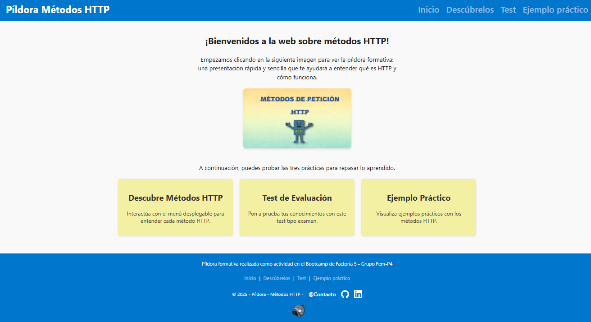
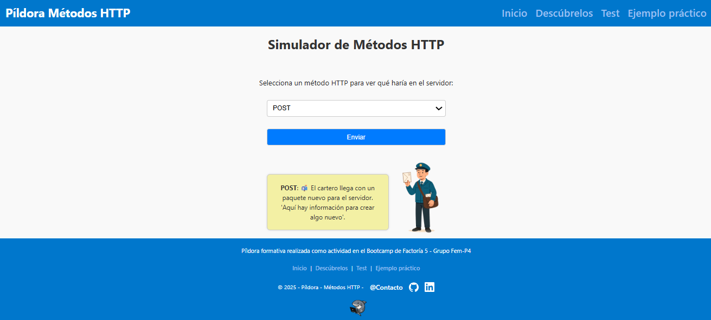
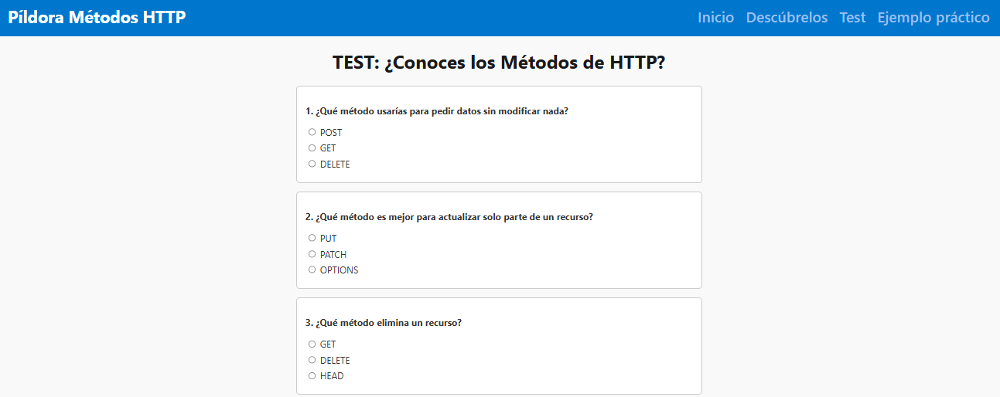
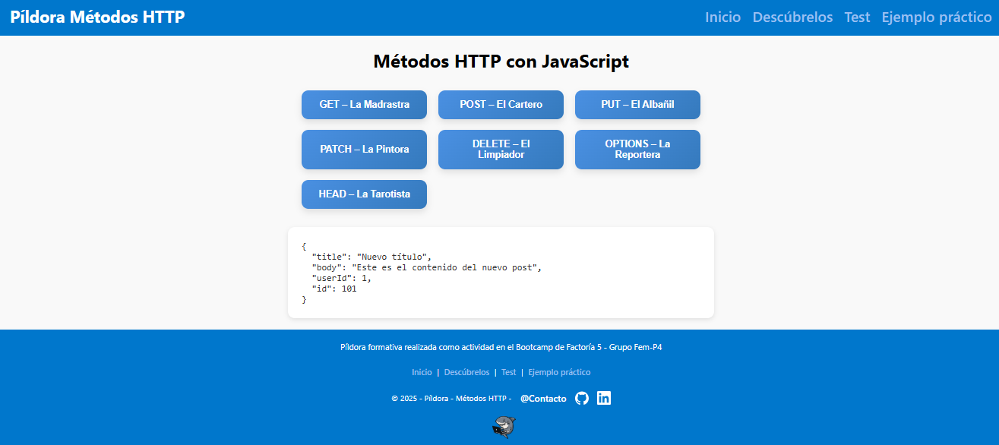
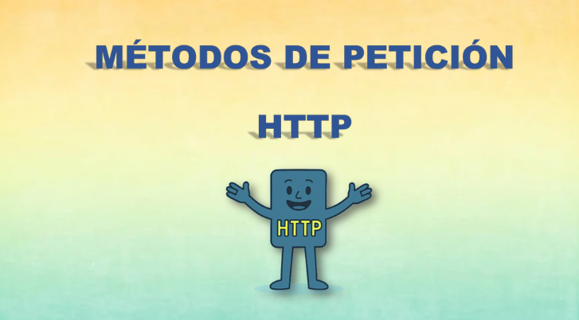

#  Píldora - Métodos de Petición HTTP

Descubre una guía visual y práctica para entender cómo tu navegador se comunica con los servidores en internet.

## ¿Qué encontrarás?

* Qué es HTTP y cómo funciona  
* Roles del cliente y el servidor  
* Estructura de una URL  
* Métodos HTTP más comunes: GET, POST, PUT, DELETE, etc.  
* Códigos de estado más habituales  
* Ejemplo práctico con fetch  

Aquí tenéis el enlace de la presentación completa:  
[Presentación completa en Canva](https://metodos-de-peticion-http.my.canva.site/pildora-formativa)

---

## Capturas de la web

### Página Principal  
  
Una visión general de la página principal donde podrás acceder a todas las funcionalidades.

### Descubre  
  
Aquí aprenderás con la píldora formativa sobre HTTP y sus métodos.

### Test  
  
Zona para comprobar y simular métodos HTTP directamente.

### Práctica  
  
Ejercicios prácticos para poner en marcha lo aprendido con fetch y APIs.

### Presentación  
  
Una vista previa de la presentación que acompaña la píldora formativa.

---

¡Espero que la disfrutéis! 😉

  

